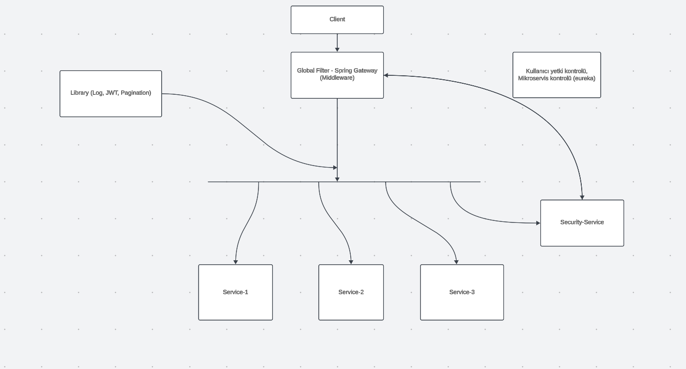

# 📦 Logistics ERP - Microservices Platform

This project encompasses the backend and frontend components of a comprehensive Enterprise Resource Planning (ERP) system tailored for a logistics company. It features a highly scalable microservice architecture on the backend and a modern single-page frontend.

---

## 🛠️ Technical Stack & Architecture

### ☕ Backend (Java Spring Boot 3)
An enterprise-level backend built on a scalable **Microservices Architecture** using **Java 17** and **PostgreSQL**.

* **Service Discovery & Routing:** 
  * Set up **Eureka Discovery Server** to enable seamless service discovery and inter-service communication.
  * Implemented **Spring Cloud Gateway** as a centralized entry point to manage, route, and secure incoming requests.
* **Centralized Configuration:** Managed all microservice `.yml` configuration files centrally via **Spring Cloud Config**, securely fetched from a private Git repository using **SSH keys**.
* **Security & Authentication:**
  * Developed a dedicated **Security-Service** implementing **JWT (JSON Web Token)** for secure session handling and token-based authentication.
  * Built a custom middleware system using **Spring Cloud Gateway GlobalFilter** to perform logging, JWT verification, and authorization checks *before* requests reach individual microservice controllers.
  * Designed a robust **User-Role-Permission** management system with **Many-to-Many** cardinality, enabling fine-grained, permission-based access control.
* **Data Access & Communication:**
  * Utilized **Hibernate** and **Spring Data JPA** for efficient database abstraction and ORM management.
  * Enabled synchronous inter-service communication over HTTP using the **OpenFeign (Feign Client)** annotation.
* **Cross-Cutting Concerns (Logging & Monitoring):**
  * Implemented **Aspect-Oriented Programming (AOP)** to decouple business logic from logging, using pointcuts/join points (`@Around`, `@Before`, `@After`, `@AfterThrowing`) for enhanced debugging.
  * Integrated **Log4j2** to maintain structured daily log rotations, categorized by log levels *(Note: ELK Stack integration is planned for future phases)*.
* **DevOps & Deployment:** Packaged each microservice into individual **Docker images** and orchestrated the entire multi-container ecosystem using **Docker Compose** for a single-command local development setup.

### ⚛️ Frontend (React.js)
A modern, responsive User Interface built to complement the microservice ecosystem.

* **Architecture & UI Components:** Developed a robust **Single Page Application (SPA)** infrastructure utilizing **React.js** combined with the **PrimeReact** component library for rich enterprise UI elements.
* **Design Patterns:** Applied clean coding standards and advanced React patterns, including structured component design, custom Hooks, global State Management, and efficient prop drilling prevention.

---

## 🚀 How To Run (Services Startup Order)

To ensure the microservices communicate correctly, please start the applications in the following strict order. 

> 💡 **Tip:** If you prefer using containers, you can also spin up the entire ecosystem using the `docker-compose.yml` file in the root directory.

### 1️⃣ Eureka Server
* **Application:** `EurekaServerApplication`
* **Description:** Provides the central registry for registering and discovering services. Other microservices and the API Gateway refer to this server to retrieve routing registries. **Must be running first.**
* **URL:** `http://localhost:8761/eureka/`

### 2️⃣ Cloud Config Server
* **Application:** `CloudConfigServerApplication`
* **Description:** Manages and serves the configuration (`.yml`) files for all microservices independently from the Git repository.

### 3️⃣ API Gateway Server
* **Application:** `ApiGatewayServerApplication`
* **Description:** Retrieves service data from Eureka to route incoming requests. It evaluates dynamic endpoints based on the user's module and operation permissions extracted from the JWT token.

### 4️⃣ Security Service
* **Application:** `SecurityServiceApplication`
* **Description:** Houses the shared traits, authentication, and core functionalities for the various user modules. This common module must be active before accessing individual business modules.

### 5️⃣ Sea Service (Logistics Module)
* **Application:** `SeaServiceApplication`
* **Description:** The specific business logic application required to perform logistics operations within the **Sea Module**.

---

## 📊 System Architecture Diagram

Below is the conceptual logic and architecture flow of the platform:

